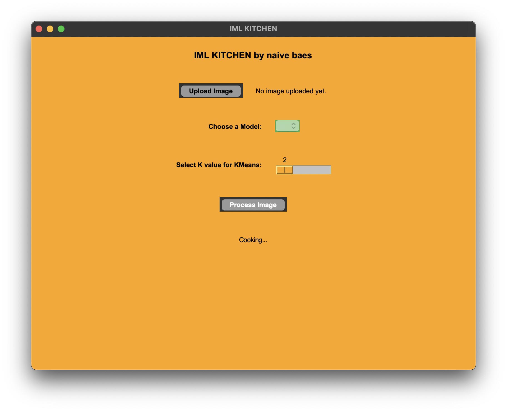
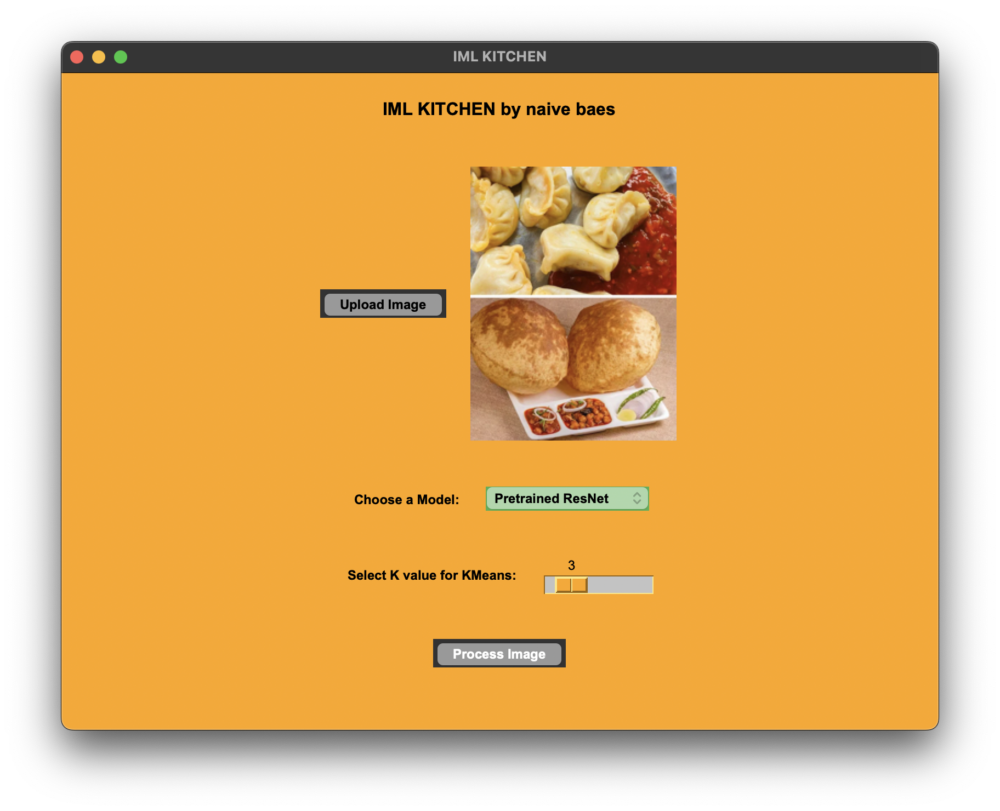
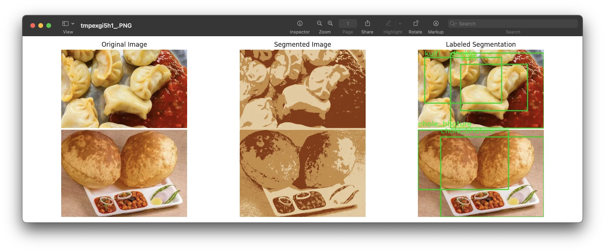
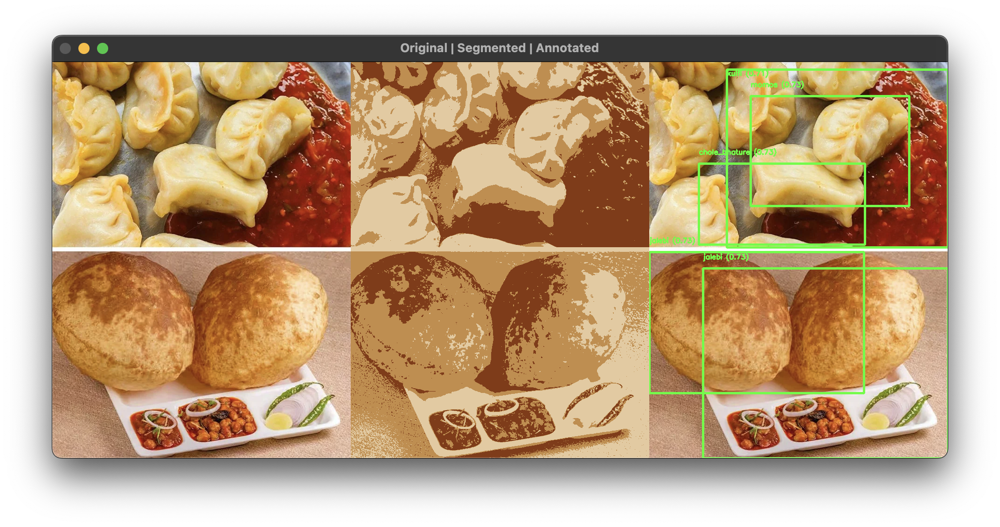

# Indian Food Recognition  

## Overview  
This project is a machine learning-based system for recognizing Indian food items from images. The models are **trained on individual food images** but **tested on composite images** containing multiple food items. The goal is to **detect and label multiple known food items** in unseen composite images.  

The system supports three different models:  

- **Multiclass Classification Model** – A single model trained on all individual images and labels, predicting the most likely food category per image.  
- **Multi-Label Model** – A separate model is trained for each food item, enabling detection of multiple foods in a composite image.  
- **Pretrained ResNet-50 Model** – Fine-tuned for Indian food classification, leveraging transfer learning for feature extraction.  
 
Team : **Jaee Ponde, Kashyap J and Saumya Mishra**
## Dataset  
The dataset consists of **20 Indian food classes**, each containing approximately **300 images** of isolated food items. The models were trained on these **individual images** and later tested on **composite images** with multiple foods.  
[Dataset Link](https://www.kaggle.com/datasets/l33tc0d3r/indian-food-classification)  

## Features  
✅ Three recognition models with different classification strategies  
✅ Trained on individual images, tested on multi-food composite images  
✅ User-friendly interface for uploading and classifying images  
✅ Support for both single and multiple food items per image  
✅ Fine-tuned ResNet-50 for improved accuracy  

## User Interface & Results  
Below are sample images of the UI and the model predictions:  

### 🖥️ UI Screenshot  
  
  

### 📊 Prediction Results  
Multiclass Model - 
  
MultiLabel (Ensemble) Model - 
 
PreTrained Resnet 50 - 
 
## Installation  

Follow these steps to set up and run the project locally:  
  
```bash
git clone https://github.com/kshypjn/IMLFoodProject.git
cd IMLFoodProject
pip install -r requirements.txt
python3 main.py

